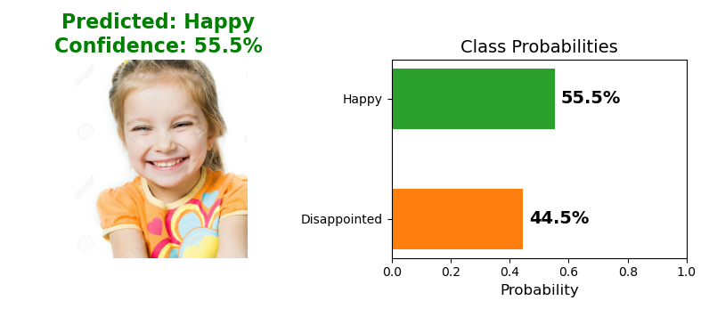
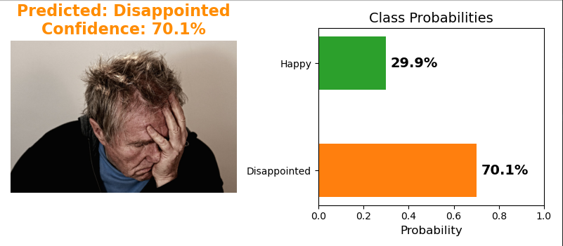

# Facial-Expression-Recognition-0.1

Binary classification: **Happy** vs **Disappointed**


## 📝 Overview

This project aims to build a Facial Expression Recognition (FER) system using a Convolutional Neural Network (CNN). The model is designed to classify facial expressions into two categories: Happy vs Disappointed. By using the FER2013 dataset, the model learns to identify emotional expressions from facial images, which can be applied in various fields like human-computer interaction, emotion recognition, and AI-driven applications.


## 🚀 Quick Start

### 1. Install Dependencies

```bash
pip install -r requirements.txt
```

### 2. Prepare Dataset

- Download the FER2013 dataset from the [Kaggle link](https://www.kaggle.com/datasets/msambare/fer2013), and extract it to the `Dataset/` directory. The folder structure should include separate folders for training and testing data. 
- Ensure that each folder contains subfolders for each emotion, such as "Happy", & "Disapointed".


### 3. Train the Model

```bash
python train.py
```

This will:
- Train the CNN model
- Save the best model as `fer_model_best.keras`
- Save the final model as `fer_model_final.keras`
- Generate `training_history.png`

### 4. Make Predictions

```bash
python predict.py

# Single image
python predict.py path/to/image.jpg

# Multiple images
python predict.py img1.jpg img2.jpg img3.jpg

# All images in a folder
python predict.py --folder Pictures/
```


## ⚙️ Configuration

```python
TRAIN_PATH = './Dataset/Train'    
VALID_PATH = './Dataset/Test'     
```


## 🎓 Training

| Parameter | Value |
|-----------|-------|
| Image Size | 48 × 48 |
| Batch Size | 32 |
| Initial Learning Rate | 0.001 |
| Optimizer | Adam |
| Loss Function | Categorical Crossentropy |
| Max Epochs | 50 |


## 📊 Expected Results

The training process achieved the following results:

- **Training accuracy**: ~85%
- **Validation accuracy**: ~78-82%
- **Minimal overfitting**: The training and validation curves are close together, suggesting the model generalizes well.

### Training History
Below is a graph showing the training and validation accuracy and loss over the epochs:


### 🖼️ Prediction Results

Here are two examples of how the model predicts facial expressions:

### Example 1: Happy Expression




### Example 2: Disappointed Expression




## 🙏 Acknowledgments

- [FER2013 Dataset](https://www.kaggle.com/datasets/msambare/fer2013) - Facial Expression Recognition Challenge
- [TensorFlow/Keras](https://www.tensorflow.org/) - Deep learning framework


## 📧 Contact

- Md. Naimur Rahman - naimur005@gmail.com
